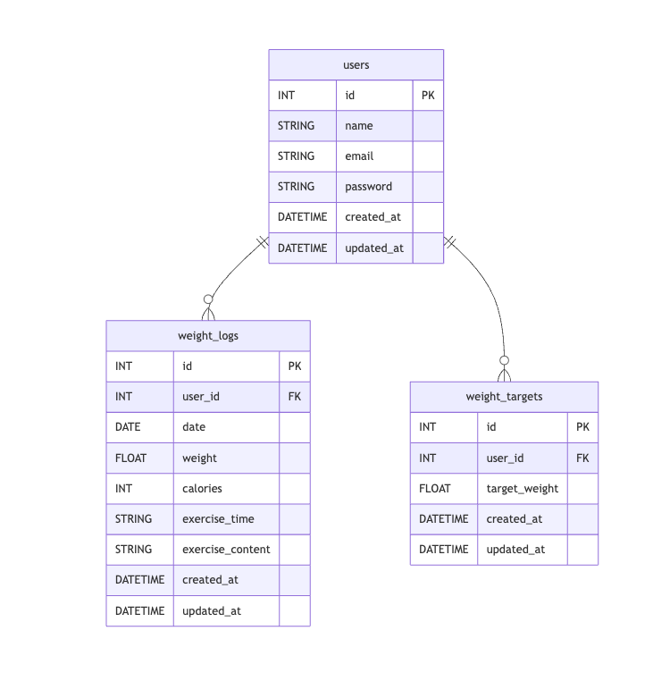

# PiGLy（体重管理アプリ）

## 環境構築

- Docker のビルドからマイグレーション、シーディングまでのコマンドや順序を記述する

```sh
# 1. イメージビルド＆起動
docker compose up -d --build
# 2. コンテナに入る
docker compose exec app bash
# 3. .envファイルのコピー
cp .env.example .env
# 4. アプリキー生成
php artisan key:generate
# 5. マイグレーション＆シーディング
php artisan migrate --seed
# 6. キャッシュクリア（必要に応じて）
php artisan config:clear
php artisan cache:clear
php artisan view:clear
php artisan route:clear
```

## 使用技術（実行環境）

- Laravel 8.x
- PHP 7.4
- Docker
- Laravel Fortify（認証）
- MySQL, Nginx など

## ER 図

## URL

- 例）開発環境: http://localhost/
